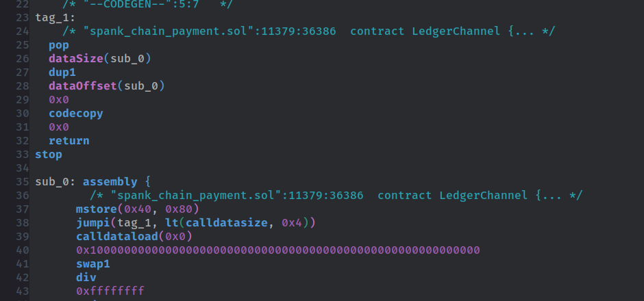

# evm-mode

Emacs major mode for editing Ethereum EVM bytecode.

## Screenshot

## Installation

- Automatic package installation from [Melpa](https://melpa.org/).
  + Please see the [Melpa's getting started tutorial](https://melpa.org/#/getting-started) for more details.

- Manual installation by putting the [evm-mode.el](evm-mode.el) file in Emacs' load path.

## Features

### Supported

- Syntax highlight for EVM bytecode.

- Code outline (labels and blocks) via [Imenu](https://www.gnu.org/software/emacs/manual/html_node/emacs/Imenu.html)

### Todo

- [ ] Auto indentation
